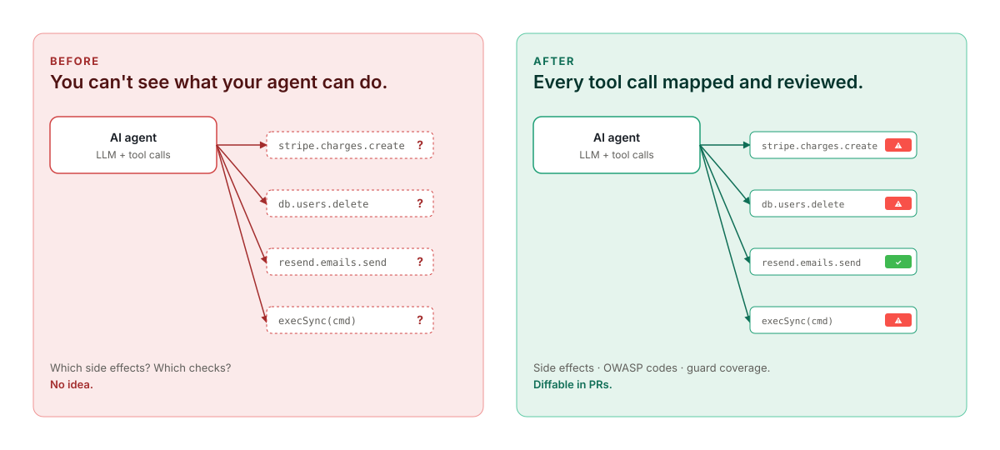
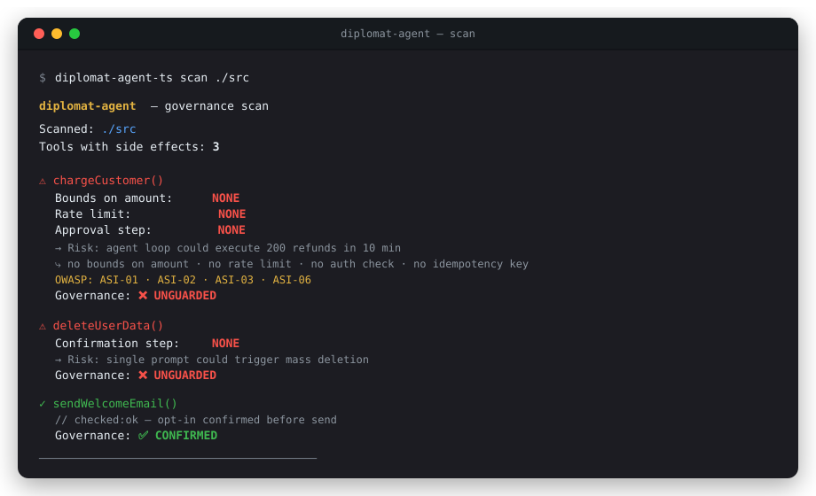
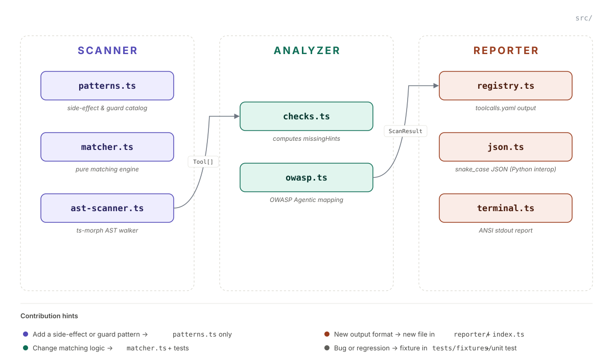

# diplomat-agent-ts

<p align="center">
  <a href="https://github.com/Diplomat-ai/diplomat-agent-ts/discussions">Discussions</a> ·
  <a href="https://github.com/Diplomat-ai/diplomat-agent-ts/blob/main/CONTRIBUTING.md">Contributing</a> ·
  <a href="https://github.com/Diplomat-ai/diplomat-agent-ts/blob/main/CHANGELOG.md">Changelog</a> ·
  <a href="https://github.com/Diplomat-ai/diplomat-agent-ts/issues">Issues</a>
</p>

[](https://www.npmjs.com/package/@diplomat-ai/diplomat-agent-ts)
[](https://github.com/Diplomat-ai/diplomat-agent-ts/actions/workflows/ci.yml)
[](https://www.npmjs.com/package/@diplomat-ai/diplomat-agent-ts)
[](https://nodejs.org)
[](LICENSE)
[](https://owasp.org/www-project-top-10-for-large-language-model-applications/)

> **You shipped a TypeScript AI agent. Do you know every function it can call that writes to a database, sends an email, charges a card, or deletes data — and which ones have zero checks?**

`diplomat-agent-ts` runs a static AST scan and tells you exactly that. Two dependencies. ~9 s on a 7,874-file TypeScript agent codebase (OpenClaw, M-series). ~30 s on slower x86 hardware without a `tsconfig.json`.

```bash
npm install -D @diplomat-ai/diplomat-agent-ts
npx diplomat-agent-ts scan .        # scan from project root
npx diplomat-agent-ts scan ./src    # or a specific subdirectory
```

<p align="center">
  
</p>

## What it looks like

<p align="center">
  
</p>

## Why this matters for AI agents

In a web app, a human clicks a button. The UI has validation, confirmation dialogs, rate limits per session.

In an agent, an LLM decides which functions to call, with what arguments, how many times. It doesn't know your business rules. It can loop, hallucinate arguments, or get prompt-injected.

**Without guards in the code, there's nothing between the LLM's decision and the real-world consequence.**

We scanned the [OpenClaw](https://github.com/openclaw/openclaw) agent codebase at pinned commit [`49d9996d`](https://github.com/openclaw/openclaw/commit/49d9996d3d99f5d05ce6e83b67b55ad0655ec6a5) (7,874 TypeScript files, ~9 s on M-series, ~30 s on x86). **419 tool calls had real side effects. 332 of them (79%) had zero checks.** Not a single one was confirmed.

## What it detects

40+ patterns across 12 side-effect categories:

| Category | Examples (TS-native) | Required guards |
|---|---|---|
| `payment` | `stripe.charges.create()`, `stripe.refunds.create()` | bounds, rate limit, approval |
| `database_write` | Prisma `.create()` / `.update()`, Mongoose `.save()` | input validation, rate limit |
| `database_delete` | Prisma `.delete()`, Mongoose `.deleteOne()`, raw `DELETE` | batch protection, confirmation |
| `http_write` | `axios.post()`, `fetch(POST)`, `got.put()` | rate limit, retry bound |
| `email` | `nodemailer.sendMail()`, `resend.emails.send()`, `sgMail.send()` | rate limit |
| `messaging` | `twilio.messages.create()`, `slack.chat.postMessage()` | rate limit |
| `agent_invocation` | `agent.run()`, `graph.invoke()`, `Runner.run()` | input validation, approval |
| `llm_call` | `openai.chat.completions.create()`, `anthropic.messages.create()` | — |
| `publish` | `s3.send(PutObjectCommand)`, `client.publish()` | approval |
| `dynamic_code` | `eval()`, `new Function()`, `vm.runInNewContext()` | confirmation |
| `file_delete` | `fs.rm()`, `fs.unlink()`, `fs-extra.remove()` | confirmation |
| `destructive` | `execSync()`, `spawnSync()`, `execa()` | confirmation |

**What counts as a guard:** input validation (Zod, Yup, class-validator), rate limiting (NestJS `@Throttle`, custom decorators), auth checks (NestJS guards, middleware), confirmation steps, idempotency keys, retry bounds. Full catalog in [`src/scanner/patterns.ts`](./src/scanner/patterns.ts).

## Quick start

```bash
# Scan from your project root (default: current directory)
diplomat-agent-ts scan .

# Or a specific subdirectory
diplomat-agent-ts scan ./src
diplomat-agent-ts scan ./packages

# Generate the toolcalls.yaml SBOM (commit this)
diplomat-agent-ts scan . --output-registry toolcalls.yaml

# Fail CI when new unguarded tool calls appear
diplomat-agent-ts scan . --fail-on-unchecked

# JSON output for IDE agents, automation, custom dashboards
diplomat-agent-ts scan . --format json
```

The scanner emits:
- A coloured ANSI report to stdout (default)
- `toolcalls.yaml` — a diff-stable registry of every detected tool call (with `--output-registry`)
- JSON — `snake_case` field names, interoperable with the [Python scanner](https://github.com/Diplomat-ai/diplomat-agent) (`--format json`)

## Integrate everywhere

### CI — block unguarded PRs

```yaml
# .github/workflows/diplomat.yml
- name: Diplomat governance scan
  run: npx -y @diplomat-ai/diplomat-agent-ts scan . --fail-on-unchecked
```

Exit code `1` if any tool call has `no_checks` status. Exit `0` otherwise — even if `partial_checks` exist (they're warnings, not blockers).

### Pre-commit hook

```yaml
# .pre-commit-config.yaml
repos:
  - repo: local
    hooks:
      - id: diplomat-agent-ts
        name: diplomat governance scan
        entry: npx -y @diplomat-ai/diplomat-agent-ts scan . --fail-on-unchecked
        language: system
        pass_filenames: false
```

### IDE — review what the copilot wrote

The scanner runs locally in under 10 seconds on typical agent codebases. Ask Claude Code, Copilot, or Cursor to run it after generating tool-calling code:

> "Run `diplomat-agent-ts scan .` and fix any unguarded tool calls."

> **Note:** AI agents (Claude Code, Copilot, Cursor) may summarize scan output inaccurately when the result is long. Always read the raw stdout — or pipe to a file with `--output report.txt` and read that.

## Acknowledge a tool call

When a function is intentionally unguarded or protected outside the static-analysis scope, mark it inline:

```ts
// checked:ok — protected by middleware/approval.ts
export async function chargeCustomer(amount: number, customerId: string) {
  return stripe.charges.create({ amount, currency: "usd", customer: customerId });
}
```

`diplomat:ok` and `canary:ok` are accepted as aliases. The next scan moves the call to `confirmed` status with an empty `missing_hints` list. The annotation appears in the YAML registry so reviewers can audit *why* something was confirmed.

## `toolcalls.yaml` — a behavioral SBOM

Like `package-lock.json`, but for what your agent can *do*, not what it depends on:

```yaml
spec_version: "1.0"
language: typescript

summary:
  total: 12
  no_checks: 8
  partial_checks: 3
  confirmed: 1

tool_calls:
  - function: chargeCustomer
    file: src/payments.ts
    line: 42
    actions:
      - "return stripe.charges.create({ amount, currency, customer })"
    checks: []
    missing:
      - no bounds on amount
      - no rate limit
      - no idempotency key
    owasp: [ASI-01, ASI-02, ASI-03, ASI-06]
```

Commit it. Diff it in PRs. When your agent gains a new capability, the change shows up in review — before it ships.

Spec → [`docs/toolcalls-yaml-spec.md`](./docs/toolcalls-yaml-spec.md)

## OWASP Agentic Top 10 mapping

Each finding is tagged with one or more relevant codes from the OWASP Agentic Security Initiative Top 10. The v0.1.0 catalog covers the codes most directly tied to static side-effect detection (ASI-01, ASI-02, ASI-03, ASI-04, ASI-05, ASI-06, ASI-10). Codes that require runtime context (ASI-07 supply chain, ASI-08 misalignment, ASI-09 deception) are out of scope for static analysis — they are covered by [diplomat-gate](https://github.com/Diplomat-ai/diplomat-gate) and [diplomat.run](https://diplomat.run) at runtime.

| Code | Risk | When it fires |
|---|---|---|
| `ASI-01` | Excessive Agency | Side effect with no auth check |
| `ASI-02` | Tool Misuse | Any side effect (baseline tag) |
| `ASI-03` | Privilege Compromise | Payments, deletes, destructive ops with no confirmation |
| `ASI-04` | Resource Overload | Agent invocations without bounds |
| `ASI-05` | Cascading Hallucination | LLM call chained to side effect |
| `ASI-06` | Identity Spoofing | Missing rate limit or retry bound |
| `ASI-10` | Overreliance | Nested agent invocations |

Full mapping in [`src/analyzer/owasp.ts`](./src/analyzer/owasp.ts).

## Architecture

<p align="center">
  
</p>

Three pure stages, no shared state. See [`CONTRIBUTING.md`](./CONTRIBUTING.md) for full guidelines.

## Benchmarks

Real codebases, real numbers.

**Methodology.** File counts are the number of `.ts` / `.tsx` files actually scanned after the scanner's built-in exclusions (`node_modules/`, `dist/`, `build/`, `*.test.ts`, `*.spec.ts`, `*.d.ts`). They can differ from a raw `git ls-files` count by a few percent. Runs are pinned to the commits below. Findings counts (`tool_calls`, `no_checks`, `partial`) reproduce exactly at those commits; raw file totals on `main` will drift over time.

| Codebase (scope) | Type | TS files scanned | Tool calls | `no_checks` | `partial` | Pinned commit |
|---|---|---|---|---|---|---|
| **OpenClaw** (`src/`) | Application | 7,874 | 419 | 332 (79%) | 87 | [`49d9996d`](https://github.com/openclaw/openclaw/commit/49d9996d3d99f5d05ce6e83b67b55ad0655ec6a5) |
| Mastra (`packages/`) | Framework | 2,777 | 185 | 162 (88%) | 23 | [`38b87964`](https://github.com/mastra-ai/mastra/commit/38b87964359268d634023a3d94e9f421ae3fcd05) |
| OpenAI Agents JS (`packages/`) | Framework | 426 | 33 | 31 (94%) | 2 | [`629d35af`](https://github.com/openai/openai-agents-js/commit/629d35af99e1ba80fc968b0d062c070caed0683d) |
| OpenAI Agents JS (`examples/`) | Examples | 302 | 32 | 28 (88%) | 4 | [`629d35af`](https://github.com/openai/openai-agents-js/commit/629d35af99e1ba80fc968b0d062c070caed0683d) |

Run the benchmarks yourself:

```bash
# Application — OpenClaw (pinned commit for reproducibility)
git clone https://github.com/openclaw/openclaw /tmp/openclaw
cd /tmp/openclaw && git checkout 49d9996d && cd -
npx diplomat-agent-ts scan /tmp/openclaw/src

# Framework — Mastra
git clone --depth 1 https://github.com/mastra-ai/mastra /tmp/mastra
npx diplomat-agent-ts scan /tmp/mastra/packages

# Framework + Examples — OpenAI Agents JS
git clone --depth 1 https://github.com/openai/openai-agents-js /tmp/openai-agents
npx diplomat-agent-ts scan /tmp/openai-agents/packages
npx diplomat-agent-ts scan /tmp/openai-agents/examples
```

## Output formats

| Format | Flag | Use case |
|---|---|---|
| Terminal (default) | — | Human review |
| JSON | `--format json` | IDE agents, dashboards, automation |
| YAML registry | `--format registry` *or* `--output-registry FILE` | `toolcalls.yaml` SBOM, PR diffs |

## Known limitations

- **Static analysis only** — no runtime detection. If a guard is added by middleware or a gateway outside the file, annotate with `// checked:ok — protected by [where]`.
- **Intra-procedural** — guard detection looks at the same function or its immediate decorators. Cross-file guard chains require an annotation.
- **TypeScript files only** — `.ts` and `.tsx` files are scanned. Plain `.js` files are skipped silently. For Python agents, use [diplomat-agent](https://github.com/Diplomat-ai/diplomat-agent). The scanner emits a warning if no `.ts` files are found in the target directory.
- **ORM patterns require the import** — Mongoose, Sequelize, and TypeORM use generic method names (`.save()`, `.create()`), so the patterns are scoped to files that import the ORM. Re-exported models may be missed.
- **Abstraction layers** — if a repo wraps its ORM or HTTP client behind a custom module (e.g. `db.ts` re-exporting Prisma without a direct `import 'prisma'`), call sites in consumers won't carry the `importContains` scope and may be missed. Use `// checked:ok` at the wrapper boundary.
- **Large repos without tsconfig** — scanning 5,000+ files without a `tsconfig.json` can take 30–60 s on slower machines (9 s on M-series for 7,874 files). Point at a subdirectory (`scan ./src`) to reduce scope.

Full limitations and pattern refinement history → [`docs/limitations.md`](./docs/limitations.md)

## Roadmap

- [x] AST scanner with 40+ patterns across 12 categories
- [x] `toolcalls.yaml` behavioral SBOM with diff-stable output
- [x] OWASP Agentic Top 10 mapping
- [x] CI integration (`--fail-on-unchecked`)
- [x] `// checked:ok` annotations (with `diplomat:ok` / `canary:ok` aliases)
- [x] Validated against OpenClaw (7,874 files, ~9 s on M-series / ~30 s on x86, pinned commit `49d9996d`)
- [ ] Inter-procedural decorator resolution (v0.2)
- [ ] SARIF 2.1.0 output (v0.2)
- [ ] `--diff-only` for changed files (v0.2)
- [ ] MCP server scanning (v0.3)
- [ ] VS Code extension with inline diagnostics

## Requirements

- Node.js ≥ 20
- 2 runtime dependencies: `ts-morph` (TypeScript compiler wrapper), `yaml`

## Sibling projects

- [**diplomat-agent**](https://github.com/Diplomat-ai/diplomat-agent) — the original Python scanner
- [diplomat-gate](https://github.com/Diplomat-ai/diplomat-gate) — runtime enforcement (CONTINUE / REVIEW / STOP in < 1ms)
- [diplomat.run](https://diplomat.run) — hosted control plane with hash-chained audit trail

## Community & support

- **Questions and ideas** → [GitHub Discussions](https://github.com/Diplomat-ai/diplomat-agent-ts/discussions)
- **Bug or false positive** → [open an issue](https://github.com/Diplomat-ai/diplomat-agent-ts/issues/new?template=bug_report.yml)
- **New pattern request** → [pattern request template](https://github.com/Diplomat-ai/diplomat-agent-ts/issues/new?template=pattern_request.yml)
- **Security vulnerability** → see [SECURITY.md](./SECURITY.md)

## Contributing

PRs welcome. The architecture above tells you exactly where things live. Read [`CONTRIBUTING.md`](./CONTRIBUTING.md) first — it explains the "patterns are data, not logic" rule that keeps the matcher simple.

## License

Apache 2.0 — Copyright 2026 Diplomat Services SAS. See [`LICENSE`](./LICENSE).
